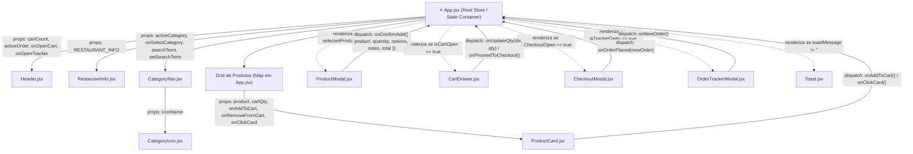
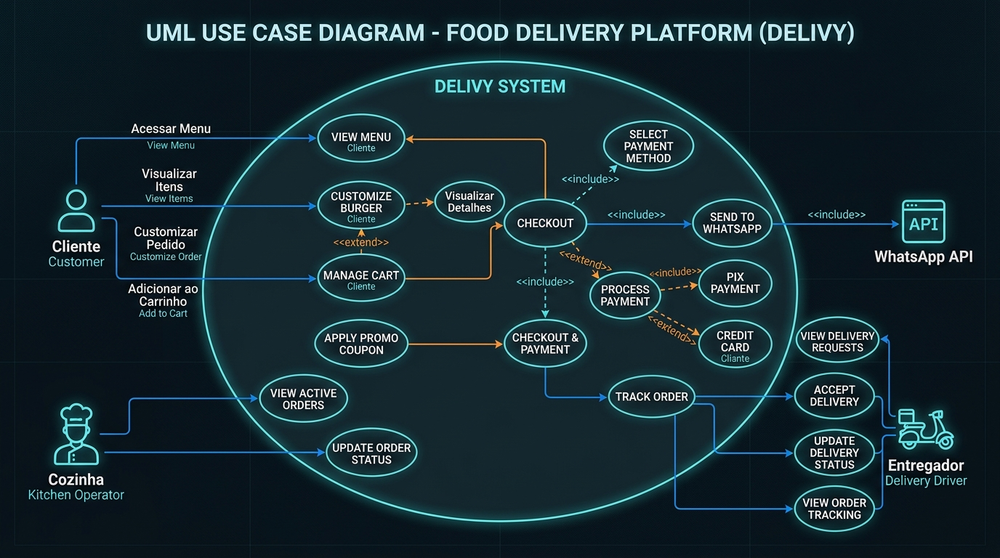
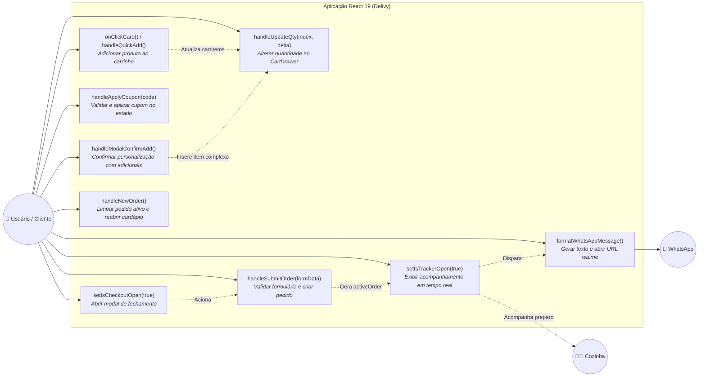
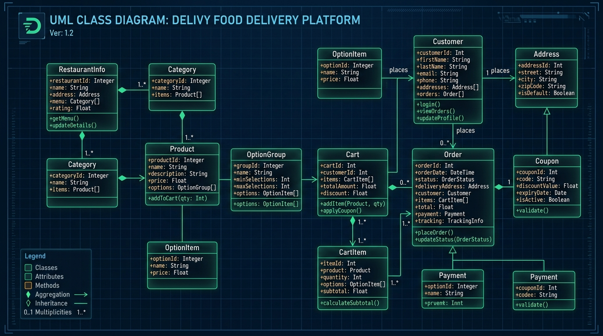
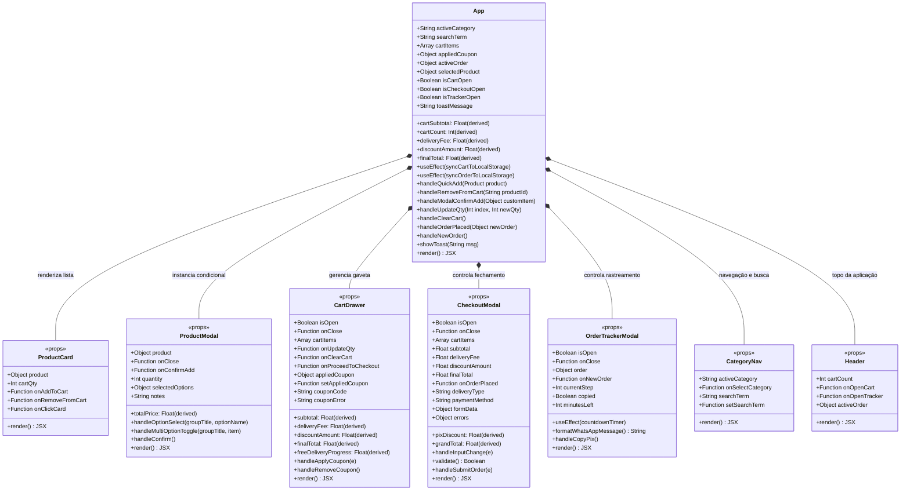
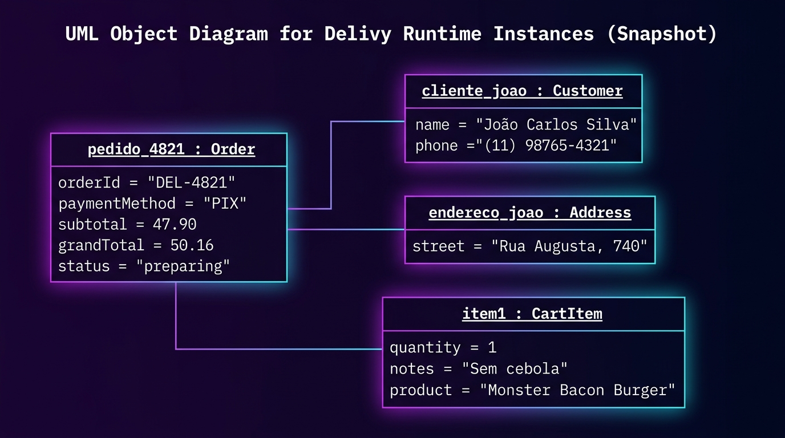
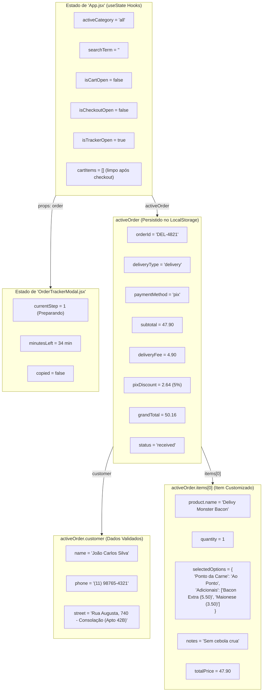
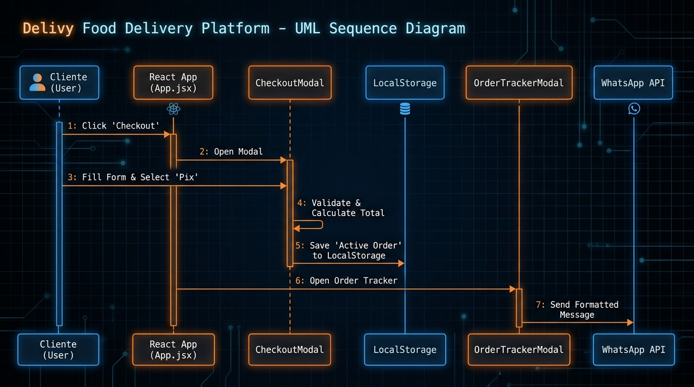
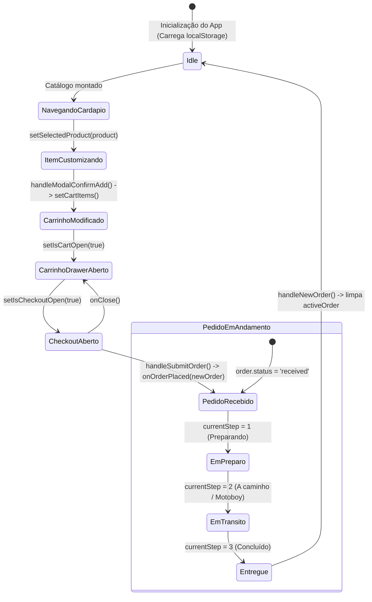

# ⚛️ Delivy — Documentação Técnica e Arquitetura de Software em React 19

---

## 1. Visão Geral da Arquitetura React 19

O **Delivy** é uma SPA (*Single Page Application*) desenvolvida sobre a versão mais recente do **React (19.2+)**, utilizando o empacotador **Vite 8** e paradigma puramente funcional baseado em **React Hooks**, **Componentização Modular**, **Fluxo Unidirecional de Dados (Props Down, Events Up)** e **Persistência Reativa com LocalStorage**.

### 1.1 Características Chave no Ecossistema React:
* **Functional Components & Hooks:** 100% dos componentes utilizam funções e hooks nativos (`useState`, `useEffect`). Sem dependência de bibliotecas pesadas de estado global (como Redux ou MobX), mantendo performance ultrarrápida com estado centralizado no nó raiz (`App.jsx`).
* **Sincronização Reativa com LocalStorage:** Efeitos (`useEffect`) monitoram mutações nos estados de `cartItems` e `activeOrder`, persistindo automaticamente em disco sem intervenção manual.
* **Composição de Modais e Portais Lógicos:** Renderização condicional de Modais (`ProductModal`, `CheckoutModal`, `OrderTrackerModal`) e Gaveta lateral (`CartDrawer`) via propagação de booleanos e callbacks de fechamento.
* **Cálculo Derivado em Tempo Real (Derived State):** Subtotal, taxa de entrega, descontos e total líquido são calculados durante a fase de renderização, eliminando problemas de sincronia de estado duplo.

---

## 2. Diagrama de Árvore de Componentes e Fluxo de Dados React

O diagrama abaixo ilustra a hierarquia completa da Virtual DOM do React, as **Props descendentes** e os **Callbacks ascendentes**:



---

## 3. Diagrama de Casos de Uso com Event Handlers React



Mapeia as ações do usuário vinculadas diretamente aos disparadores de eventos e handlers do React:



---

## 4. Diagrama de Classes UML dos Componentes React



Modela a estrutura orientada a componentes do React: **Estados Internos (`useState`)**, **Efeitos (`useEffect`)**, **Propriedades Tipadas (`Props`)** e **Métodos Handlers**:



---

## 5. Diagrama de Objetos UML (Estado Vivo da Virtual DOM em Execução)



Ilustra o estado concreto das instâncias e dos Hooks em tempo de execução no React durante o atendimento do pedido `#DEL-4821`:



---

## 6. Diagrama de Sequência UML: Fluxo de Estado e Efeitos React



Mapeia a troca ordenada de chamadas de funções, re-renderizações e sincronizações de efeitos entre os componentes React:

```mermaid
sequenceDiagram
  autonumber
  actor Cliente as 👤 Cliente
  participant ProdCard as 🎴 ProductCard
  participant App as ⚛️ App.jsx
  participant ProdModal as 🪟 ProductModal
  participant Drawer as 🛒 CartDrawer
  participant Checkout as 📋 CheckoutModal
  participant LocalStorage as 💾 LocalStorage
  participant Tracker as ⏱️ OrderTrackerModal

  Cliente->>ProdCard: Clica em produto com adicionais
  ProdCard->>App: onClickCard(product)
  App->>App: setSelectedProduct(product)
  App->>ProdModal: Renderiza com props { product, isOpen: true }
  
  Cliente->>ProdModal: Escolhe 'Ao Ponto' e 'Bacon Extra'
  ProdModal->>ProdModal: setSelectedOptions(...) -> recalcula totalPrice
  Cliente->>ProdModal: Clica em "Adicionar ao Pedido"
  ProdModal->>App: onConfirmAdd({ product, quantity, selectedOptions, notes, totalPrice })
  
  App->>App: setCartItems([...prev, customItem])
  App->>LocalStorage: useEffect() detecta mudança e salva 'delivy_cart'
  App->>ProdModal: setSelectedProduct(null) -> desmonta modal
  
  Cliente->>Drawer: Clica em "Finalizar Pedido"
  Drawer->>App: onProceedToCheckout()
  App->>App: setIsCartOpen(false); setIsCheckoutOpen(true)
  App->>Checkout: Renderiza CheckoutModal com { cartItems, finalTotal }

  Cliente->>Checkout: Preenche dados, seleciona Pix e clica em Confirmar
  Checkout->>Checkout: validate() == true -> dispara confetti()
  Checkout->>App: onOrderPlaced(newOrder)
  
  App->>App: setActiveOrder(newOrder); setCartItems([])
  App->>LocalStorage: useEffect() salva 'delivy_active_order' e remove 'delivy_cart'
  App->>App: setIsCheckoutOpen(false); setIsTrackerOpen(true)
  App->>Tracker: Renderiza OrderTrackerModal com { order: newOrder }
  Tracker-->>Cliente: Exibe chave Pix Copia e Cola e Linha do Tempo
```

---

## 7. Diagrama de Ciclo de Vida do Pedido (Statechart)

Especifica as transições da máquina de estados do pedido com foco nas mutações de estado do React:



---

## 8. Dicionário de Dados dos Objetos de Estado React

### 8.1 Estrutura do Estado `cartItems`
```javascript
[
  {
    product: {
      id: "b1",
      name: "Delivy Monster Bacon",
      price: 38.90,
      category: "burgers"
    },
    quantity: 1,
    selectedOptions: {
      "Ponto da Carne": "Ao Ponto (Suculento)",
      "Adicionais Extras": [
        { name: "Bacon Crocante Extra", price: 5.50 },
        { name: "Maionese Verde da Casa (50ml)", price: 3.50 }
      ]
    },
    notes: "Sem cebola crua",
    totalPrice: 47.90
  }
]
```

### 8.2 Estrutura do Estado `activeOrder`
```javascript
{
  orderId: "DEL-4821",
  createdAt: "2026-10-04T19:30:00.000Z",
  items: [ /* cartItems */ ],
  deliveryType: "delivery", // 'delivery' | 'pickup'
  customer: {
    name: "João Carlos Silva",
    phone: "(11) 98765-4321",
    street: "Rua Augusta",
    number: "740",
    neighborhood: "Consolação",
    complement: "Apto 42B",
    changeFor: ""
  },
  paymentMethod: "pix", // 'pix' | 'card' | 'cash'
  subtotal: 47.90,
  deliveryFee: 4.90,
  discountAmount: 0.00,
  pixDiscount: 2.64,
  grandTotal: 50.16,
  status: "received" // 'received' | 'preparing' | 'delivering' | 'completed'
}
```

---

## 9. Comandos Operacionais do React 19 (Vite)

```bash
# Instalar dependências
npm install

# Iniciar servidor de desenvolvimento HMR
npm run dev

# Análise de lint e regras de Hooks
npm run lint

# Build de produção otimizado com Rollup
npm run build
```
